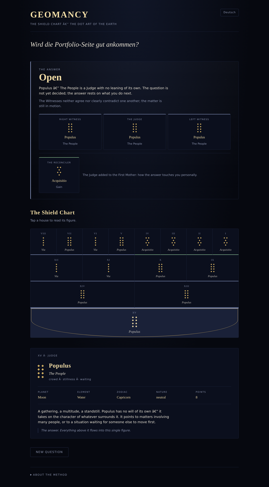

# Geomancy — Das Schildbild

A complete geomantic shield chart, cast by hand and interpreted. Vanilla
JavaScript, no framework, no build step. German and English.



## What it does

Geomancy reached Europe in the twelfth century as ʿilm al-raml, the *science of
the sand*, and stayed one of the most widely practised divinatory arts until the
Renaissance. It is unusual among such arts in being almost entirely
deterministic: only sixteen random lines go in, and everything else follows from
two mechanical operations.

1. **Ask.** The question is stated up front and stays on screen throughout.
2. **Cast.** The querent taps an uncounted number of times; only the parity of
   the taps survives into the line. Sixteen lines make four *Mothers*.
3. **Derive.** The *Daughters* are the Mothers read down the columns instead of
   across the rows. The *Nieces* are Mothers and Daughters added in pairs. Two
   *Witnesses*, then the *Judge*, then the *Reconciler* follow by the same
   addition.
4. **Read.** All sixteen figures carry a name, a planetary, elemental and
   zodiacal attribution, and an interpretation. The Judge gives the verdict; the
   two Witnesses say where the matter came from and where it is going.

## Why the chart is worth computing

Addition here is parity: two lines make a double point if their sum is even and
a single point if it is odd. In `GF(2)` that is exclusive-or, and it has a
pleasant consequence — the Judge's total point count is *always* even.

Each Judge line is the XOR of all four Nieces, which expands to the XOR of every
Mother line once via the Mothers and once via the Daughters. Summed across the
four lines, every term cancels. So only eight of the sixteen figures can ever
sit as Judge: Via, Populus, Coniunctio, Carcer, both Fortunae, Acquisitio and
Amissio. The traditional instruction is to discard any chart whose Judge falls
outside that set — a medieval checksum.

`assertValid()` enforces it on every chart, and the test suite verifies it over
two thousand random castings.

## Running it

The modules are native ES modules, so the page needs to be served rather than
opened from the file system:

```sh
python3 -m http.server 8000
# then open http://localhost:8000
```

Deployed as-is on GitHub Pages — there is nothing to build.

## Tests

```sh
node --test test/geomancy.test.mjs   # chart derivation, 16 cases
node test/walkthrough.mjs            # end-to-end in Chromium, needs playwright
```

The logic modules import nothing from the DOM, which is what makes the
derivation testable in Node without a browser.

## Layout

```
index.html
css/style.css
js/
  figures.js    the sixteen figures: patterns, attributions, interpretations
  geomancy.js   chart derivation and validation — pure, no DOM
  i18n.js       interface strings and the active-language store
  render.js     DOM construction; holds no state
  main.js       application flow: ask → cast → read
test/
  geomancy.test.mjs
  walkthrough.mjs
```

## Sources

Planetary, elemental and zodiacal attributions follow Heinrich Cornelius
Agrippa, *De Occulta Philosophia* (Book II), as reproduced in Stephen Skinner,
*Geomancy in Theory and Practice*. The interpretations are condensed from the
same tradition.

## Licence

GPL-3.0
